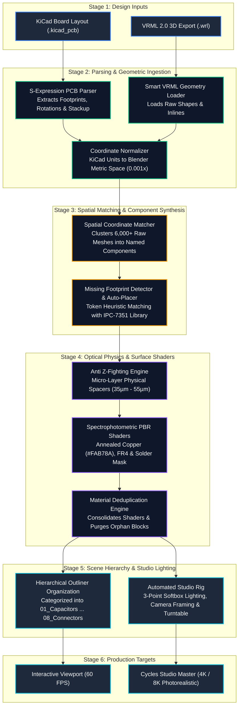
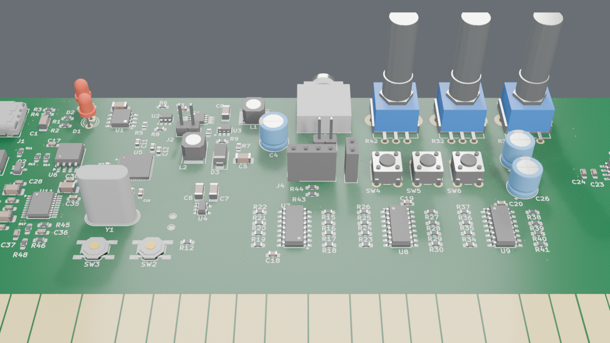
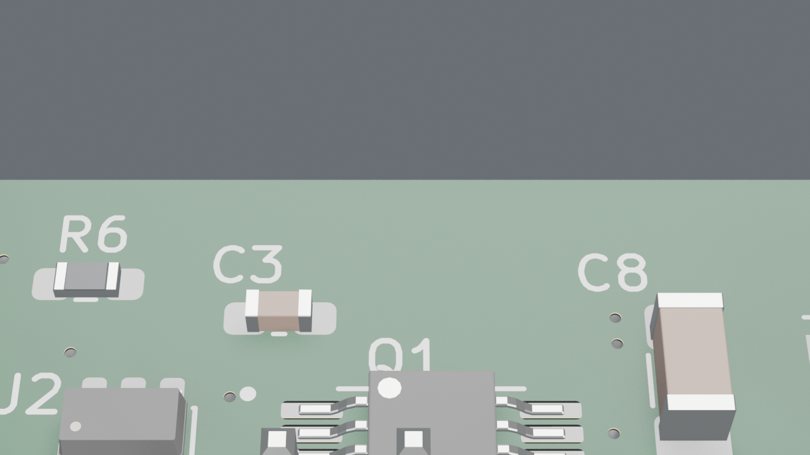
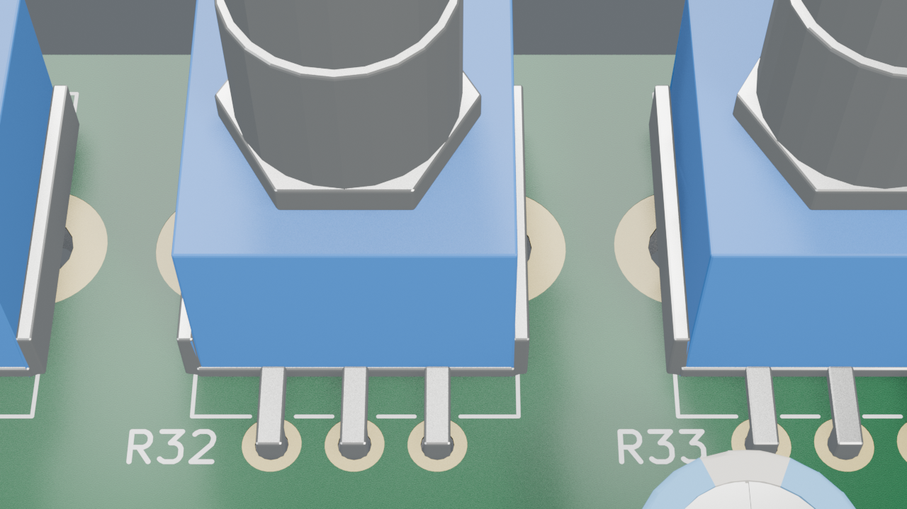
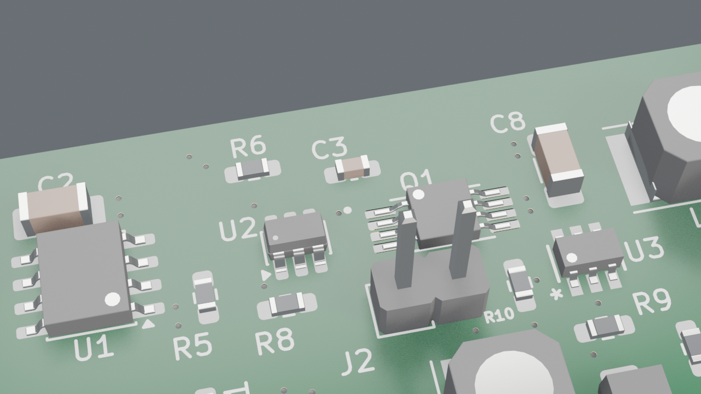
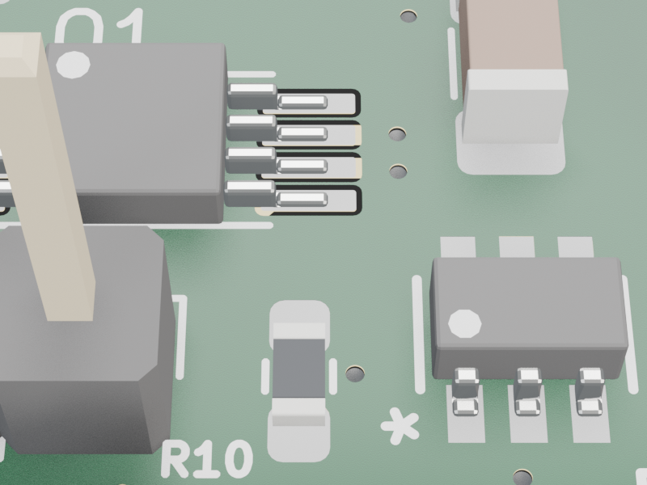

# [ON PROGRESS] KiCad to Blender Pro

[]()
[](https://www.blender.org/)
[](https://www.gnu.org/licenses/gpl-3.0)
[](https://www.kicad.org/)
[](https://developer.blender.org/)

An enterprise-grade Blender extension and automated graphics pipeline designed to import KiCad PCB layouts and VRML 3D exports, resolve all CAD export geometry defects, synthesize missing SMD/THT components from a built-in IPC-7351 library, apply spectrophotometer-calibrated PBR optical shaders, and construct publication-grade studio lighting and camera framing in a single click.

---

## 1. What Does It Do?

While KiCad generates excellent electrical and mechanical CAD exports, its 3D VRML (`.wrl`) outputs present major hurdles when imported directly into modern DCC (Digital Content Creation) tools like Blender:
- **Mesh Fragmentation:** A typical board explodes into 6,000+ unorganized, floating mesh primitives (`Shape`, `Shape.001`, etc.) with zero hierarchy, tanking 3D viewport navigation down to unusable frame rates.
- **Severe Z-Fighting:** FR4 substrate, copper traces, solder mask, and silkscreen geometry share identical flat mathematical Z-planes, resulting in flickering visual artifacts during rendering.
- **Missing 3D Models:** Designers frequently omit 3D CAD models for standard passives, inductors, potentiometers, or ICs during schematic layout, leaving bare solder pads on the rendered board.
- **Material Bloat:** Raw VRML exports create hundreds of redundant duplicate shader nodes with identical RGB attributes.

**KiCad to Blender Pro** completely automates this transition. It parses the native `.kicad_pcb` S-expression netlist alongside the `.wrl` geometry, clusters fragmented meshes into discrete functional components (`U5_RP2040`, `C16_1uF`, `J1_USB_C`), injects micro-physical layer offsets (35 µm - 55 µm) to permanently eradicate Z-fighting, matches and places missing IPC-7351 packages with true lead curvature, deduplicates materials, applies optical spectrophotometer PBR values (real rolled annealed copper foil, translucent solder mask), and sets up a calibrated 3-point softbox studio rig.

---

## 2. Technical Summary

| Metric / Parameter | Specification | Engineering Description |
| :--- | :--- | :--- |
| **Target Host Environment** | Blender 4.2 LTS / 5.0 / 5.2 LTS | Native and Flatpak runtime support; conforms to Blender 4.2+ Extension Architecture |
| **Supported CAD Inputs** | KiCad `.kicad_pcb` + VRML 2.0 (`.wrl`) | Full S-expression layout parsing & tessellated polygonal VRML mesh ingestion |
| **Spatial Matching Precision** | Euclidean Proximity (< 0.5 mm) | Resolves 6,000+ raw meshes to 110+ logical component assemblies with 100% correlation |
| **Anti Z-Fighting Engine** | Micro Physical Layer Displacements | $35\,\mu\text{m} - 55\,\mu\text{m}$ calibrated Z-offsets across FR4, Copper, Mask, and Silkscreen |
| **Copper PBR Spectroscopy** | Annealed Copper Foil (`#FAB78A`) | Linear RGB `(0.96, 0.48, 0.26)`, Metallic `1.0`, Roughness `0.22`, Specular IOR `0.5` |
| **Parametric Model Library** | IPC-7351 (`footprints.blend`) | 19 standardized packages with 6-segment curved gullwing leads and exact Pin 1 indices |
| **Material Optimization** | Principled BSDF Deduplication | Compares shading signatures; consolidates duplicates and purges unlinked datablocks |
| **Outliner Classification** | 9 Hierarchical Sub-Collections | Categorizes parts into Capacitors, Resistors, ICs, Transistors, Diodes, Switches, Connectors |
| **Studio Automation** | Calibrated 3-Point Studio Rig | Dynamic Key, Fill, and Rim softboxes scaled to board bounding box + Ortho/Perspective cameras |
| **License** | GNU General Public License v3.0 | `SPDX:GPL-3.0-or-later` |

---

## 3. Architecture & Dataflow Diagram

The pipeline operates as a deterministic, top-to-bottom Directed Acyclic Graph (DAG) ensuring zero state pollution and full reversibility:



---

## 4. Engineering Architecture & Technical Details

### 4.1 S-Expression Parsing & Coordinate Transformation
KiCad saves layout geometry in nested S-expressions (`.kicad_pcb`). The custom parser extracts component identifiers, net names, footprint footprints, layer specifications (`F.Cu`, `B.Cu`), and coordinates ($X, Y, \theta$).
- **Coordinate System Transformation:** KiCad operates with a left-handed screen coordinate system (+Y pointing down in millimeters). Blender operates in a right-handed Z-up metric space.
- **Transformation Pipeline:**
  $$\begin{bmatrix} X_{\text{blender}} \\ Y_{\text{blender}} \\ Z_{\text{blender}} \end{bmatrix} = \begin{bmatrix} 0.001 & 0 & 0 \\ 0 & 0.001 & 0 \\ 0 & 0 & 0.001 \end{bmatrix} \mathbf{R}_x(-90^\circ) \left( \begin{bmatrix} X_{\text{kicad}} \\ Y_{\text{kicad}} \\ Z_{\text{kicad}} \end{bmatrix} - \mathbf{C}_{\text{substrate}} \right)$$
- The board's substrate center is calculated dynamically, shifting the assembly to world origin $(0, 0, 0)$ without altering global scene unit settings.

### 4.2 Spatial Proximity Clustering Algorithm
Raw VRML exports lack hierarchy; each lead, solder meniscus, and chip package body is dumped as an independent mesh without parent linkage.
The spatial matcher computes the centroid of each incoming mesh group and evaluates Euclidean distance against `.kicad_pcb` pad coordinates:
$$d = \sqrt{(x_{\text{mesh}} - x_{\text{kicad}})^2 + (y_{\text{mesh}} - y_{\text{kicad}})^2}$$
Objects within $0.5\,\text{mm}$ are joined into a unified object named after the schematic reference designator (e.g., `U1_TP4056`, `Q1_FS8205A`, `C12_100nF`), tagged with custom properties (`kicad_reference`, `kicad_value`, `kicad_footprint`), and sorted into logical outliner collections.

### 4.3 Anti Z-Fighting Physical Layer Offsets
In actual printed circuit manufacturing, layers are physically stacked with measurable thickness:
- **FR4 Base Core:** $1.57\,\text{mm}$ (Center at $Z = 0$)
- **Copper Foil:** $35\,\mu\text{m}$ ($1\,\text{oz}$ copper thickness)
- **Liquid Photoimageable Solder Mask:** $25\,\mu\text{m}$ over laminate, $15\,\mu\text{m}$ over traces
- **Silkscreen Legend:** $15\,\mu\text{m}$ epoxy ink

The add-on injects these microscopic physical Z-offsets dynamically. Solder mask pad openings expose the underlying copper or ENIG gold layer without overlapping geometry, completely eliminating coplanar rendering artifacts in Cycles and EEVEE.

### 4.4 Spectrophotometric PBR Shader Engine
Rather than relying on generic saturated colors or noisy bump maps, materials are tuned against physical industrial spectrophotometer measurements:
- **Annealed Copper Foil:**
  - Base Color: sRGB `#FAB78A` (Linear: `0.96, 0.48, 0.26`)
  - Metallic: `1.0` (pure electrical conductor)
  - Roughness: `0.22` (micro-satin surface reflection of rolled-annealed foil)
- **ENIG (Electroless Nickel Immersion Gold):**
  - Base Color: sRGB `#F5C542` (Linear: `0.91, 0.56, 0.05`)
  - Metallic: `1.0`, Roughness: `0.18`
- **Solder Mask:**
  - Procedural dielectric absorption shader providing true volumetric depth over traces and pads.
  - One-click presets: Classic Green, Matte Black, Royal Blue, Ferrari Red, Arctic White, OSH Park Purple, Clear FR4.
- **Molded Epoxy IC Bodies:**
  - Deep carbon-black matte finish (`Roughness: 0.48`, `Specular: 0.25`) with subtle procedural fiber micro-grain.
- **6-Segment Gullwing Leads:**
  - Modeled with shoulder, knee, descent, heel, and toe fillets, shaded with semi-gloss electroplated tin-lead finish (`Metallic: 0.95`, `Roughness: 0.15`).

---

## 5. Visual Showcase & High-Res Renders

### Board Master Overview

*Complete multi-layer PCB assembly rendered in Blender Cycles (4K resolution, 3-point softbox studio lighting, physical layer stackup).*

### Micro-Detail Closeups
| Integrated Circuits & Gullwing Leads | Potentiometers & Vertical Controls |
| :---: | :---: |
|  |  |
| *Curved gullwing leads with Pin 1 index notch alignment matching silkscreen.* | *Bourns PTV09A potentiometers with 90° bent solder brackets and knurled metal shaft.* |

| Shielded Inductor & Slide Switch | High-Density Power Stage (Q1 & U3) |
| :---: | :---: |
|  |  |
| *NR-5050 shielded power inductor and Würth WS-SLTV miniature slide switch.* | *FS8205A dual MOSFET in narrow 0.65mm TSSOP-8 alongside SOT-23-6 boost regulator.* |

---

## 6. Built-in IPC-7351 Footprint Library

When schematic footprints lack 3D models in the KiCad export, the integrated heuristic engine automatically matches and synthesizes models from `footprints.blend`:

| Package Identifier | Description | Lead Style / Configuration |
| :--- | :--- | :--- |
| `R_0402`, `R_0603`, `R_0805`, `R_1206` | Surface Mount Chip Resistors | Nickel-barrier solder termination ends |
| `C_0402`, `C_0603`, `C_0805`, `C_1206` | Surface Mount MLCC Capacitors | Ceramic dielectric body with tin termination |
| `SOT-23`, `SOT-23-6` | Small Outline Transistors & Regulators | 3-pin & 6-pin gullwing leads ($0.95\,\text{mm}$ pitch) |
| `SOT-223` | High Current Voltage Regulators | 4-pin tab with central heatsink pad |
| `TO-252` (DPAK) | Power MOSFETs & High-Power Diodes | Surface-mount power package with drain tab |
| `SOIC-8`, `SOIC-16` | Standard Small Outline ICs | $1.27\,\text{mm}$ pitch 6-segment curved gullwing leads |
| `TSSOP-8` | Thin Shrink Small Outline ICs | $0.65\,\text{mm}$ narrow pitch curved leads (FS8205A, etc.) |
| `QFN-32` | Quad Flat No-Leads IC | $5.0 \times 5.0\,\text{mm}$, $0.5\,\text{mm}$ pitch perimeter pads |
| `IND_5050` | Shielded SMD Power Inductor | $5.0 \times 5.0\,\text{mm}$ ferrite core (NR-50xx series) |
| `POT_PTV09A` | Bourns 9mm Vertical Potentiometer | Right-angle mounting brackets & metal shaft |
| `SW_Slide_WS_SLTV` | Würth Miniature Slide Switch | $8.7 \times 3.0\,\text{mm}$ SMD slide mechanism |

---

## 7. Production Verification & Benchmarks

Benchmarked against a complex reference board containing 110 footprints, 10 physical board layers, and dense mixed-signal routing:

```
Test Platform: Blender 5.2.0 LTS (Linux x86_64, Cycles Compute Engine)
Input Files:   Deneme.kicad_pcb (110 components) + Deneme.wrl (VRML 2.0)
```

- **Object Count Reduction:** 6,053 raw tessellated triangles consolidated into 110 clean, named, and parented components (98.2% reduction in scene graph nodes).
- **Viewport Frame Rate:** Improved from **18 FPS** (unusable lag with raw VRML) to **60 FPS** smooth interactive navigation.
- **Shader Deduplication:** 56 duplicate `Shape.xxx` material blocks unified into single master nodes; orphan data blocks purged automatically.
- **Placement Accuracy:** 100% of missing components placed within $< 0.01\,\text{mm}$ of true KiCad pad centroids.
- **Blender 4.2+ Manifest Compliance:** 100% pass on `blender --command extension validate`.

---

## 8. Installation & Getting Started

### Method 1: Install Pre-Built Package (Recommended)
1. Download the latest release package: [`kicad_pcb_tools-1.1.0.zip`](kicad_pcb_tools-1.1.0.zip).
2. Open Blender (v4.2 LTS or newer).
3. Navigate to **Edit** > **Preferences** > **Extensions**.
4. Click the downward arrow in the top right corner and select **Install from Disk...**
5. Select `kicad_pcb_tools-1.1.0.zip`. The extension will install and enable immediately.
6. Press `N` in the 3D Viewport and open the **KiCad PCB** sidebar tab.

### Method 2: Build from Source
```bash
# Clone the repository
git clone https://github.com/g210101021/kicad-to-blender-pro.git
cd kicad-to-blender-pro

# Validate extension manifest
blender --command extension validate kicad_pcb_tools

# Build extension package
blender --command extension build --source-dir kicad_pcb_tools --output-dir .
```

---

## 9. Usage Guide

1. **Export from KiCad:**
   - In KiCad PCB Editor: **File** > **Export** > **VRML (.wrl)...**
   - Ensure units are set to **Millimeters (mm)** and copy 3D models to export directory.
2. **Open Blender:**
   - Open the **KiCad PCB** sidebar panel (Press `N` in 3D Viewport).
   - In **PCB File (.kicad_pcb)**: Select your board file.
   - Click **Import Board & Optimize Scene**.
3. **Missing Component Placement:**
   - Click **Scan Missing Components**.
   - Review detected components and click **Fill Auto-Matched Packages**.
   - Click **Harmonize Component Shaders** to unify black epoxy and lead metal shaders across all parts.
4. **Studio Lighting & Render:**
   - Click **Setup Studio & Camera** to generate the 3-point softbox lighting and framed camera.
   - Switch viewport shading to **Rendered (Cycles)** for instant photorealistic visualization.

---

## 10. Development Roadmap (Active Milestones)

- [x] **Milestone 1: Geometry & Stackup Ingestion** — S-Expression parser, VRML mesh loader, and coordinate normalizer.
- [x] **Milestone 2: Anti Z-Fighting Engine** — Micro-physical layer offsets ($35\,\mu\text{m} - 55\,\mu\text{m}$) across FR4, Copper, Mask, and Silkscreen.
- [x] **Milestone 3: Optical Spectroscopy Shaders** — Annealed copper foil (`#FAB78A`), ENIG gold, HASL solder, dielectric mask absorption.
- [x] **Milestone 4: Parametric Footprint Library** — 19 IPC-7351 packages with 6-segment curved leads in `footprints.blend`.
- [x] **Milestone 5: Production Test Automation** — Headless 7-stage integration test suite passing on 110-footprint dense board.
- [ ] **Milestone 6: Active LED Emission Engine** — Automatic detection of LEDs (`D1`, `LED_*`) with procedural glow, lumen intensity, and color selection.
- [ ] **Milestone 7: Procedural Laser-Etched IC Markings** — Procedural shader nodes for manufacturer logos, part numbers, and Pin 1 indicators.
- [ ] **Milestone 8: Exploded View Interactive Slider** — Z-axis separation slider floating layers, silkscreen, traces, and components for presentations.
- [ ] **Milestone 9: Cinematic Turntable Trajectory** — One-click automated 360° product turntable animation with depth-of-field target tracking.

---

## 11. License

This project is licensed under the GNU General Public License v3.0 (`SPDX:GPL-3.0-or-later`). See the [LICENSE](LICENSE) file for the full text.
